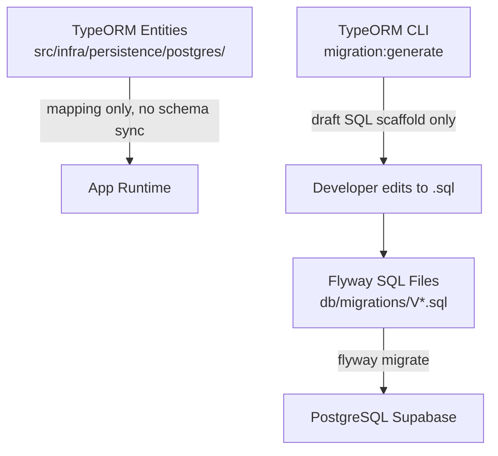

# Flyway Migration Setup — StyleUp Backend

## Analysis Summary

- **ORM:** TypeORM 0.3.30 — `synchronize: false` confirmed in both [`data-source.ts`](data-source.ts) and [`src/infra/postgres/postgres.module.ts`](src/infra/postgres/postgres.module.ts)
- **DB:** PostgreSQL via Supabase
- **Existing migrations:** 9 TypeScript files in [`src/migrations/`](src/migrations/) — all already applied; raw SQL lives inside `queryRunner.query()` calls
- **Env keys already present** (no new ones needed): `DATABASE_URL`, `POSTGRES_HOST/PORT/USER/PASSWORD/DB`, `POSTGRES_SSL`
- **No Flyway deps** in [`package.json`](package.json)
- **Existing skills path:** `.claude/skills/` (matches where the new skill will go)

## Architecture After Transition



TypeORM entities remain for ORM query building. Flyway owns schema evolution exclusively.

## What Changes

- **`node-flywaydb` installed** — npm wrapper that downloads the Flyway CLI binary (requires Java ≥ 11)
- **New folder** `db/migrations/` at project root for all SQL files
- **9 existing TypeScript migrations** converted to `V1__` through `V9__` SQL files (SQL is already embedded in the `.ts` files as raw strings)
- **`down()` methods are dropped** — Flyway CE has no rollback; destructive changes use the two-step convention (rule 7 in the skill)
- **`src/migrations/`** remains for TypeORM entity-based scaffold generation (`migration:generate` still useful as a draft aid)
- **`data-source.ts`** migrations glob updated to `[]` — TypeORM no longer runs migrations

## Files Created / Modified

**Created:**

- `flyway.config.js` — reads `DATABASE_URL` with `POSTGRES_*` fallback, points at `db/migrations/`
- `db/migrations/V1__create_auth_users_table.sql` through `V9__add_missing_fk_indexes_and_version_columns.sql`
- `.claude/skills/flyway-migrations/SKILL.md` — the convention skill

**Modified:**

- `package.json` — install `node-flywaydb`, add `migrate`, `migrate:info`, `migrate:validate`, `migrate:repair` scripts; keep `migration:generate` as a draft scaffold tool
- `data-source.ts` — set `migrations: []`

## `flyway.config.js` shape

```js
require("dotenv").config();

const url = process.env.DATABASE_URL;
// fallback builds url from POSTGRES_* vars

module.exports = {
  flywayArgs: {
    url: `jdbc:postgresql://${host}:${port}/${db}`,
    user: process.env.POSTGRES_USER,
    password: process.env.POSTGRES_PASSWORD,
    locations: "filesystem:db/migrations",
    defaultSchema: "public",
    table: "flyway_schema_history",
    validateOnMigrate: true,
  },
  downloads: { storageDirectory: ".flyway" },
};
```

If `DATABASE_URL` is present, it is parsed to extract the JDBC components.

## npm Scripts (package.json)

| Script             | Command                  |
| ------------------ | ------------------------ |
| `migrate`          | `node-flywaydb migrate`  |
| `migrate:info`     | `node-flywaydb info`     |
| `migrate:validate` | `node-flywaydb validate` |
| `migrate:repair`   | `node-flywaydb repair`   |

`migration:generate` is kept (draft scaffold only — output must be converted to SQL before use).
`migration:run`, `migration:revert`, `migration:show` are removed.

## SQL Naming: Existing → Flyway

| Original TypeScript file                                | SQL file                                             |
| ------------------------------------------------------- | ---------------------------------------------------- |
| `1740000000000-CreateAuthUsersTable.ts`                 | `V1__create_auth_users_table.sql`                    |
| `1740000100000-DropAuthUsersScaffold.ts`                | `V2__drop_auth_users_scaffold.sql`                   |
| `1740000200000-EnableSchemaExtensions.ts`               | `V3__enable_schema_extensions.sql`                   |
| `1740000300000-CreateIdentityTables.ts`                 | `V4__create_identity_tables.sql`                     |
| `1740000400000-CreateMerchantTables.ts`                 | `V5__create_merchant_tables.sql`                     |
| `1740000500000-CreateCatalogTables.ts`                  | `V6__create_catalog_tables.sql`                      |
| `1740000600000-CreateSchedulingTables.ts`               | `V7__create_scheduling_tables.sql`                   |
| `1740000700000-CreateTransactionTables.ts`              | `V8__create_transaction_tables.sql`                  |
| `1740000800000-AddMissingFkIndexesAndVersionColumns.ts` | `V9__add_missing_fk_indexes_and_version_columns.sql` |
| _(next new migration)_                                  | `V10__<snake_case_description>.sql`                  |

## SKILL.md Structure (`.claude/skills/flyway-migrations/SKILL.md`)

The skill encodes:

1. Every schema change requires a Flyway SQL file — never ORM sync
2. Naming: `V<int>__<snake_case>.sql`, strictly incrementing, never reused
3. Never edit applied migrations — write a new one
4. Migration authoring order: table → columns/types/defaults → PK → FKs → indexes → CHECKs
5. SQL column names snake_case; TypeORM entity uses `@Column({ name: 'user_id' })`
6. Every FK column gets an index unless explicitly justified
7. Destructive changes: two-step (deprecate/backfill first, drop in a later version)
8. Local dev flow: write entity → write SQL migration → `pnpm migrate` → `pnpm migrate:info`
9. CI/CD: `pnpm migrate` runs before app boot as a separate step

Includes 3 reference example SQL files drawn from V4 (identity), V5 (merchant/geo), and V8 (transactions with EXCLUDE).

## Manual Steps You Must Do

1. **Install Java ≥ 11** if not already present — required by Flyway CLI (check: `java --version`)
2. **If the DB already has V1–V9 applied** (via TypeORM), run `pnpm migrate:repair` after setup to tell Flyway to treat those versions as already executed (or use `flyway baseline -baselineVersion=9`)
3. **Drop `typeorm_migrations` table** from the database once Flyway is confirmed working (optional cleanup)
4. Verify: `pnpm migrate:info` should show V1–V9 as `Success` and no pending migrations
