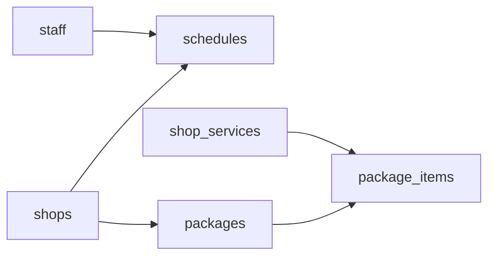

# Seed schedules, packages, package_items

## Relationships (from Flyway)

| Table                                                          | Parents                     | Key constraints                                                                                                                                                                                                                                                                                                  |
| -------------------------------------------------------------- | --------------------------- | ---------------------------------------------------------------------------------------------------------------------------------------------------------------------------------------------------------------------------------------------------------------------------------------------------------------- |
| [`schedules`](db/migrations/V7__create_scheduling_tables.sql)  | `shops`, optional `staff`   | `schedule_type` in `shop_operating_hours` \| `staff_recurring_pattern` \| `staff_break`; shop hours ⇒ `staff_id IS NULL`; staff types ⇒ `staff_id NOT NULL`; open ⇒ times set + `end > start`; closed ⇒ times NULL; GiST **EXCLUDE** blocks overlapping open windows for same `(shop_id, staff_id, day_of_week)` |
| [`packages`](db/migrations/V6__create_catalog_tables.sql)      | `shops`                     | `price_paise > 0`                                                                                                                                                                                                                                                                                                |
| [`package_items`](db/migrations/V6__create_catalog_tables.sql) | `packages`, `shop_services` | Composite PK `(package_id, shop_service_id)`                                                                                                                                                                                                                                                                     |

Existing seed parents (reuse exact UUIDs):

- Shop `275fc283-baf6-47df-93bc-970c61b0e465` — [seed/02-merchant/01-shops.sql](seed/02-merchant/01-shops.sql)
- Staff `dd92d1c8-f3b3-4d97-bca9-47c875a88c43` — [seed/02-merchant/03-staff.sql](seed/02-merchant/03-staff.sql)
- Shop service `e018d76c-af04-4524-a64e-058fb2a02bef` — [seed/03-catalog/03-shop-services.sql](seed/03-catalog/03-shop-services.sql)

**Scope default:** do not add extra catalog/shop_services or `schedule_exceptions`. Package will have **one** item (existing haircut). Skip `staff_break` rows because they would overlap `staff_recurring_pattern` and trip `ex_schedules_no_overlap`.

## File layout (parent-before-child)

Seeder already runs folders/files in sorted order ([seed/seeder.js](seed/seeder.js)). No seeder.js changes.

1. [`seed/02-merchant/04-schedules.sql`](seed/02-merchant/04-schedules.sql) — after staff
2. [`seed/03-catalog/04-packages.sql`](seed/03-catalog/04-packages.sql) — after shop_services
3. [`seed/03-catalog/05-package-items.sql`](seed/03-catalog/05-package-items.sql) — after packages

## Seed content

### `04-schedules.sql`

- Stable UUIDs for each row; `ON CONFLICT (id) DO NOTHING`
- `-- @rows` = total inserted rows
- For each weekday `1..6` (Mon–Sat):
  - `shop_operating_hours`, `staff_id` NULL, `09:00`–`20:00`, `is_closed = FALSE`
  - `staff_recurring_pattern`, staff Rahul, `09:00`–`18:00`, `is_closed = FALSE`
- Sunday `day_of_week = 7`: one `shop_operating_hours` with `is_closed = TRUE`, `start_time`/`end_time` NULL
- Set `effective_from = '2026-01-01'`, `effective_to` NULL (avoids NULL/NULL `tsrange` oddities with EXCLUDE)
- Labels like `Open` / `Rahul shift` / `Closed`

### `04-packages.sql`

- One package for Meera's Cuts, e.g. name `Haircut Combo`, `price_paise = 49900` (₹499), `is_active = TRUE`
- Fixed UUID; `ON CONFLICT (id) DO NOTHING`
- `-- @rows 1`

### `05-package-items.sql`

- One row: that `package_id` + existing `shop_service_id` `e018d76c-af04-4524-a64e-058fb2a02bef`
- `ON CONFLICT (package_id, shop_service_id) DO NOTHING`
- `-- @rows 1`

## Verify

- Run `pnpm seed` (idempotent second run should skip)
- Confirm no FK / CHECK / EXCLUDE errors

## Out of scope

- `schedule_exceptions`
- Extra catalog services for multi-item packages
- Changes to booking seeds to use `package_id`
